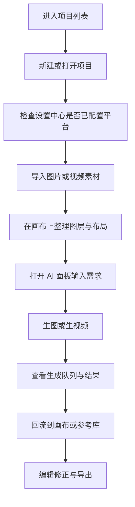

# OpenLovart 画布使用流程手册

## 1. 文档目的

本手册用于指导团队在 OpenLovart 画布中完成图片、视频、分镜相关的日常生产工作，覆盖以下内容：

- 支持的平台有哪些
- 平台如何注册、充值、申请 API Key
- API Key 在 OpenLovart 中如何配置和使用
- 画布的标准使用流程
- 团队内需要哪些角色负责
- 常见问题由谁处理

适用对象：平台管理员、运维/实施人员、画布执行人员、导演/审核人员。

## 2. 先理解这套画布是什么

当前仓库版本的 OpenLovart 是本地优先的画布工作台，特点如下：

- 认证是 demo/mock 模式，便于内部演示和本地使用
- 项目和画布数据默认保存在当前浏览器本地数据库
- API 设置默认保存在当前浏览器本地存储中
- AI 聊天、生图、视频三条链路可以分别配置不同的平台
- 当前默认平台不是统一一个，而是按功能拆分：
  - AI 聊天：MagicAPI
  - AI 生图：MagicAPI
  - AI 视频：Laomandi

这意味着两件事必须先讲清楚：

1. 换浏览器、换电脑、清理站点数据后，项目数据和 API 配置都可能丢失。
2. 同一台机器上，聊天、生图、视频可以走不同平台，各自要填各自的 Key，不能混用。

## 4. 角色与职责

建议最少拆成 4 个角色。

### 4.1 AI项目负责人

负责：

- 选择要接入的平台
- 注册平台账号
- 充值、控制预算、查看账单
- 创建 API Key 或系统令牌
- 决定是按团队共用 Key，还是按个人分 Key
- 到期、欠费、限流时统一处理

### 4.2 运维人员

负责：

- 部署 OpenLovart
- 配置 `.env.local`
- 配置 `OPENLOVART_PUBLIC_BASE_URL`
- 维护 Upscayl 服务地址和缓存目录
- 处理公网 HTTPS、内网穿透、服务器同步等问题

### 4.3 画布执行人员

负责：

- 新建项目
- 导入图片/视频素材
- 在画布上排版、标记、引用素材
- 使用 AI 聊天、生图、视频能力
- 维护项目参考库、媒体历史
- 导出最终结果

## 5. 平台支持清单

当前代码里已内置支持 6 个平台。

| 平台 | 在画布中的 Base URL | 能力范围 | 推荐用途 | 备注 |
| --- | --- | --- | --- | --- |
| 默认 AI 网关 | `https://api.bltcy.ai` | 聊天 / 生图 / 视频 | 已有内部网关时使用 | 需要按供应方文档获取 Base URL 和 API Key |
| MagicAPI / GeekNow | `https://api.geeknow.top`、`https://www.geeknow.top`、`https://geek.closeai.icu` | 聊天 / 生图 / 视频 | 当前默认聊天、生图平台 | 支持多节点 Base URL 预设 |
| Laomandi / 官方视频 | `https://api.laomandi.com` 或 `https://ark.cn-beijing.volces.com/api/v3` | 仅视频 | 当前默认视频平台 | 不参与聊天和生图路由 |

### 5.1 当前推荐平台组合

如无特殊财务或采购要求，建议按当前系统默认组合使用：

- 聊天：MagicAPI
- 生图：MagicAPI
- 视频：Laomandi

原因：

- 这是当前系统默认配置，验证路径最完整
- 视频链路已专门适配 Laomandi / Seedance 官方任务格式
- 聊天和生图则优先走 MagicAPI，减少首次接入成本

## 6. 各平台如何注册、充值、申请 API Key

### 6.1 通用标准流程

无论用哪个平台，标准顺序都应是：

1. 项目负责人选定要接入的平台。
2. 注册平台账号并完成充值。
3. 在平台控制台创建 API Key / 令牌。
4. 将 Key 配置到 OpenLovart 设置中心。
5. 现场做一次聊天、生图、视频联调。

### 6.2 默认 AI 网关

适用场景：

- 团队已经有既定供应商
- 已有内部结算方式
- 不希望每个执行人员去外部平台单独注册

操作建议：

1. 打开仓库中的 `llms.md`。
2. 按文档里的“获取 Base URL 和 API Key”说明获取接入信息。
3. 如平台提供余额/令牌查询能力，可由平台主管定期核对可用额度。
4. 在 OpenLovart 中填写：
   - Base URL：`https://api.geeknow.top`
   - API Key：平台分配的 Key

说明：

- 如果团队已经有供应商账号，这个平台最适合作为统一兜底网关。
- 若改用其他平台，不要指望它自动复用这个 Key。

### 6.3 MagicAPI / GeekNow

适用场景：

- 默认聊天、生图链路
- 希望使用多个访问节点

可用 Base URL：

- `https://api.geeknow.top`
- `https://www.geeknow.top`
- `https://geek.closeai.icu`

建议流程：

1. 注册 GeekNow / MagicAPI 平台账号。
2. 登录控制台，确认账户可用余额。
3. 按控制台实际菜单完成充值。
4. 在控制台创建 API Key 或令牌。
5. 根据网络环境选一个 Base URL：
   - 默认优先 `https://api.geeknow.top`
   - 海外线路可试 `https://www.geeknow.top`
   - 内地特定环境可试 `https://geek.closeai.icu`
6. 在 OpenLovart 的“AI聊天模型API”和“AI生图模型API”中填写。

建议：

- 普通执行人员不要自行切换不同节点，先由平台主管指定默认节点。
- 如果聊天正常但生图异常，优先检查是否同一个节点、同一个 Key。

### 6.7 Laomandi / 官方视频

适用场景：

- 视频生成为主
- 当前默认视频链路
- 需要 Seedance 官方内容任务能力

当前系统支持两种地址：

- `https://api.laomandi.com`
- `https://ark.cn-beijing.volces.com/api/v3`

建议流程：

1. 由平台主管或视频平台主管统一申请视频接口凭据。
2. 若走 Laomandi 平台账号，登录 `https://www.laomandi.com` 进行账户开通和权限确认。
3. 若走官方 Ark 路线，则由对应云平台管理员申请正式视频 API 凭据。
4. 在 OpenLovart 的“AI视频模型API”页签中：
   - 平台选择 `Laomandi / 官方视频`
   - Base URL 选择 `Laomandi 资产 API` 或 `Seedance 官方视频 API`
   - API Key 填入平台发放的凭据

关键注意事项：

- 这个平台只用于视频，不参与聊天和生图。
- 如果视频要引用本地图片、视频、音频作为素材，OpenLovart 服务必须配置公网 HTTPS 地址。
- 没有公网 HTTPS 地址时，Laomandi 素材接口无法抓取本地文件。

建议管理方式：

- 该平台不要交给普通执行人员自行注册。
- 统一由平台主管或运维配置并维护，执行人员只负责在画布内使用。

## 7. API Key 在 OpenLovart 中如何使用

这是最容易出错的地方。

### 7.1 正确用法

API Key 不是写在提示词里，也不是写在项目备注里。

正确做法是：

1. 进入设置中心。
2. 分别打开：
   - AI聊天模型API
   - AI生图模型API
   - AI视频模型API
3. 在对应页签里选择平台、填写 Base URL、填写 API Key。
4. 点击保存。

保存后，OpenLovart 会在请求时自动把以下信息带给后端：

- 平台标识
- Base URL
- API Key

执行人员不需要手工改请求头，也不需要在聊天输入框里粘贴密钥。

### 7.2 正确理解“按功能独立配置”

系统是按功能独立配置的，不是一个 Key 走全站。

举例：

- 聊天可以填 MagicAPI Key
- 生图可以填 MagicAPI Key
- 视频可以填 Laomandi Key

也可以统一成：

- 聊天 / 生图 / 视频 全部填 JieKou Key

但前提是：

- 你选中的平台确实支持该能力
- 你为该平台填写了它自己的 Key

不要假设“我填了一个默认 Key，别的平台也能自动用”。

### 7.3 API Key 管理规范

建议团队统一执行以下规则：

- 不在聊天窗口中发送真实 API Key
- 不把 Key 写进项目标题、备注、流程单
- 不把 Key 提交进 Git 仓库、截图群、普通文档
- 尽量由平台主管统一分发测试 Key 或子 Key
- 预算敏感时，按人分配 Key，便于核账

## 8. 首次上线配置流程

建议第一次使用时，严格按下面顺序走。

### 步骤 1：明确本次项目要用哪些能力

- 只做聊天和生图：先配置聊天、生图平台
- 要做视频：必须额外配置视频平台
- 要做本地视频参考上传：运维先确认公网 HTTPS 地址

### 步骤 2：完成平台账号与余额准备

- 平台管理员注册账号
- 先做小额充值
- 创建 API Key
- 记录可用 Base URL

### 步骤 3：进入设置中心

入口二选一：

- 直接打开 `/user`
- 在画布右上角点击齿轮按钮

### 步骤 4：配置三条 AI 链路

推荐配置：

1. `AI聊天模型API`
   - 平台：MagicAPI
   - Base URL：默认节点
   - API Key：聊天可用 Key
2. `AI生图模型API`
   - 平台：MagicAPI
   - Base URL：默认节点
   - API Key：生图可用 Key
3. `AI视频模型API`
   - 平台：Laomandi / 官方视频
   - Base URL：Laomandi 资产 API 或官方视频 API
   - API Key：视频可用 Key

### 步骤 5：设置默认生成参数

在“生成默认值”里建议先统一：

- 默认图片模型
- 默认视频模型
- 默认比例
- 默认时长
- 是否启用提示词增强

这样执行人员在日常使用时不会每次都重设。

### 步骤 6：配置工作台和机器相关项

按需要处理：

- 自动落盘目录
- 浏览器持久化存储授权
- CDN 缓存目录
- Upscayl 服务地址

### 步骤 7：做一次联调验证

必须至少验证 3 件事：

1. AI 聊天能正常回复
2. 能生成一张图片
3. 能提交并完成一个视频任务

## 9. 画布标准使用流程

下面这部分是给执行人员照着走的。

### 9.1 新建项目

进入 `/projects` 后：

- 点击“新建项目”
- 输入项目名称
- 创建后自动进入画布

已有项目也可以：

- 打开
- 重命名
- 复制
- 删除
- 设置封面

建议命名规则：

- `客户名_项目名_日期`
- `IP名_镜头包_版本号`

### 9.2 进入画布后的主界面认知

画布顶部重点区域：

- 左上：返回项目列表、项目标题、保存状态
- 中上：图层、历史、媒体、参考、AI 面板切换
- 右上：命令面板、快捷键、自动落盘、设置中心

画布中的常用工作区：

- 画布主区域：摆放图片、视频、文本、生成器
- 图层面板：管理元素层级和选区
- 历史面板：查看历史摘要和时间线
- 媒体面板：查看项目媒体历史
- 参考面板：查看项目参考库
- AI 面板：与 AI 对话，发起生成
- 生成队列：查看图片/视频任务状态

### 9.3 导入素材

建议先导入基础素材，再开始生成。

可做动作：

- 添加图片
- 添加视频
- 把素材拖到画布中摆放
- 在空白处右键添加基础形状

适合先导入的素材：

- 客户给的参考图
- 视频首帧
- 草图
- 角色图
- 背景板

### 9.4 建立项目参考库

参考库是这套画布很关键的能力。

建议做法：

1. 从画布中选中高质量图片。
2. 保存为项目参考图。
3. 后续在生图或生视频时直接引用。

项目参考库能做的事：

- 保存当前图片为参考
- 批量把选中图片加入参考库
- 从参考库重新插回画布
- 从参考库定位来源元素
- 清理无效参考图

建议规则：

- 参考库只留“风格锚点”素材
- 临时失败图不要长期留在参考库

### 9.5 使用 AI 对话面板

AI 面板不是只能聊天，它是实际的生产入口。

可做动作：

- 输入创意需求
- 附加本地图片
- 引用画布中的图片
- 引用画布标记
- 使用快捷指令
- 开启联网搜索
- 切换聊天模型

建议输入方式：

- 先说目标：要做什么
- 再说风格：写实、国风、广告、分镜、海报
- 再说约束：比例、镜头、元素、禁忌项
- 最后补参考：引用项目参考图或画布图

示例：

> 生成一张竖版海报，主角站在赛博夜景中，光线偏冷，品牌 logo 保持在右下角，参考当前画布中的角色图和背景图。

### 9.6 生图与生视频

画布里可直接发起图片和视频生成。

推荐顺序：

1. 先确定参考图和提示词
2. 再确认当前使用的平台和默认模型
3. 先出图，再决定是否转视频

生图时建议关注：

- 模型是否适合文生图或图生图
- 比例是否正确
- 是否引用了参考图

生视频时建议关注：

- 平台是否为视频平台
- 是否选择了正确的视频模型
- 是否需要首帧、尾帧、参考图、参考视频、参考音频
- 如果用 Laomandi，本地参考素材是否具备公网可访问地址

### 9.7 看生成队列

画布左上会显示生成队列。

队列会展示：

- 提交中
- 排队中
- 运行中
- 收尾中
- 失败

执行人员要养成两个习惯：

1. 失败时先定位到对应元素，不要盲目重试全部任务。
2. 视频任务时间长时，先看队列状态，不要一看到进度慢就误判为失败。

### 9.8 结果回流到画布

生成结果不应只停留在一次对话里，应该沉淀到项目资产里。

建议流程：

1. 对满意结果回流到画布。
2. 对可复用图片加入项目参考库。
3. 对可复用结果保留在媒体历史中。
4. 对最终版做好命名和导出。

### 9.9 二次编辑与修正

当前画布支持的典型后处理包括：

- AI 编辑图片
- 替换背景
- Mockup 合成
- 标注图片
- 裁切图片
- 分镜切割
- 从图片生成分镜计划

建议：

- 先锁定参考风格，再做局部修正
- 不要每次都从头重生，尽量走参考库和画布回流

### 9.10 导出交付

最终交付前建议做 4 件事：

1. 检查项目标题和版本号
2. 检查画布中最终保留的元素
3. 下载/导出最终图片或视频
4. 如需归档，开启自动落盘或手动转存

## 10. 日常操作建议

建议团队执行以下工作习惯：

- 每个项目只保留一个主项目，不要反复新建同名项目
- 生图满意后及时加入参考库
- 视频生成前先确认平台余额足够
- 进行小批量测试
- 不要把所有平台都配置上，先保留团队已批准的平台组合

## 11. 常见问题与处理人

### 11.1 提示 API Key 无效或已过期

现象：

- 聊天、生图或视频直接报错

处理顺序：

1. 执行人员先确认自己填的是哪个页签的 Key。
2. 检查是否把聊天 Key 填到了视频页签。
3. 仍失败时交给主管重发 Key 或确认余额状态。

责任人：

- 第一责任：平台主管
- 协助：执行人员

### 11.2 聊天能用，视频不能用

原因通常是：

- 视频平台没有单独配置
- 视频平台选了 Laomandi，但没填对应 Key

责任人：

- 第一责任：平台主管
- 协助：执行人员

### 11.3 视频参考素材上传失败

原因通常是：

- OpenLovart 只有本地地址，没有公网 HTTPS 地址
- Laomandi 无法拉取本地素材

责任人：

- 第一责任：运维 / 实施人员

### 11.4 换电脑后项目或设置不见了

原因通常是：

- 当前版本默认把项目和设置存在本地浏览器

责任人：

- 第一责任：执行人员自查
- 协助：运维说明当前保存策略

### 11.5 余额不足或扣费异常

责任人：

- 第一责任：平台主管

建议处理：

- 先查看平台账单页
- 核对使用模型和调用量
- 必要时联系平台支持

## 12. 推荐落地方案

如果团队刚开始使用，建议不要一开始就全员自由发挥，而是按下面方式落地：

### 方案 A：最稳的团队方案

- 聊天：MagicAPI
- 生图：MagicAPI
- 视频：Laomandi
- API Key：由平台主管统一分发，统一核账
- 执行人员：只负责配置和使用，不负责开户充值

## 13. 上线前检查清单

正式给团队使用前，请至少完成以下检查：

- 已确定默认平台组合
- 已完成平台充值
- 已创建 API Key
- 已在 设置界面 完成三条 AI 链路配置
- 已验证聊天正常
- 已验证生图正常
- 已验证视频正常
- 如使用 Laomandi，本地参考素材上传已验证
- 已确认执行人员知道如何保存参考图、如何查看队列、如何导出结果

## 14. 一句话版执行口径

给执行人员的最短口径可以统一成下面这段：

1. 先到设置中心配好聊天、生图、视频三类平台和 Key。
2. 进项目后先导入素材，再把关键图加入参考库。
3. 用 AI 面板出图或出视频，失败先看队列和平台配置。
4. 满意结果及时回流到画布和参考库，最后统一导出。
